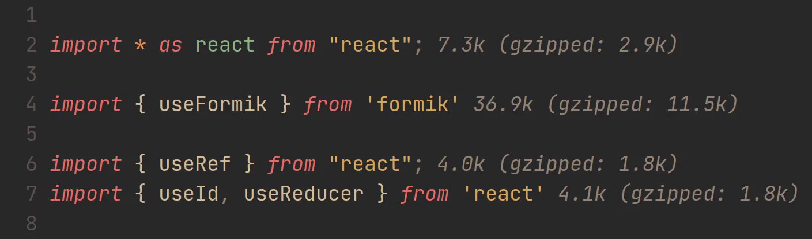

# import-cost.nvim

Display javascript import costs inside neovim, powered by
[import-cost](https://github.com/wix/import-cost).

> [!NOTE]
> Active development is hosted on
> [Forgejo](https://forge.barrettruth.com/barrettruth/import-cost.nvim).



## Installation

With `vim.pack` (Neovim 0.12+):

```lua
vim.pack.add({
  'https://forge.barrettruth.com/barrettruth/import-cost.nvim',
})
```

Or via
[luarocks](https://luarocks.org/modules/barrettruth/import-cost.nvim):

```
luarocks install import-cost.nvim
```

Dependencies are installed automatically on first use.

## Quick Start

Open a JavaScript, TypeScript, or Svelte file with import statements and wait
for inline virtual text costs to appear.

If the defaults need changing, set `vim.g.import_cost` before the plugin
loads.

```lua
vim.g.import_cost = {
  package_manager = 'yarn',
  format = {
    virtual_text = '%s',
  },
  highlight = 'Comment',
}
```

## Documentation

```vim
:help import-cost
```

## Known Issues

1. CommonJS support is flaky (limitation of the npm module)
2. Long wait times for large packages
3. [pnpm is not supported](https://forge.barrettruth.com/barrettruth/import-cost.nvim/issues/5)

## Acknowledgements

- [wix/import-cost](https://github.com/wix/import-cost/): node backend
- [import-cost](https://marketplace.visualstudio.com/items?itemName=wix.vscode-import-cost):
  original VSCode plugin
- [vim-import-cost](https://github.com/yardnsm/vim-import-cost): vim inspiration
